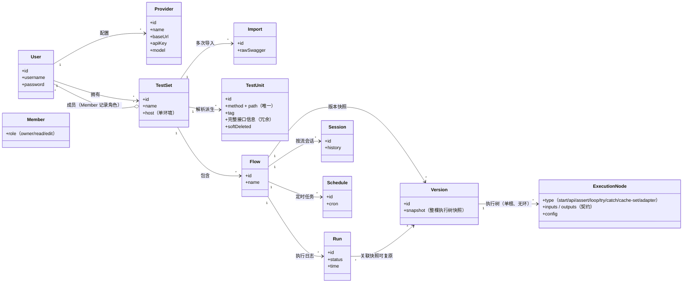

<div align="center">


# 鉴枢 (kianshu)

**AI 驱动的集成测试平台** —— 导入 Swagger 生成测试单元，由 LLM 生成可执行、可人工编辑的树形测试流。

</div>

---

## 简介

鉴枢(kianshu)是一个全新的集成测试平台。用户导入 Swagger 文档获得测试单元，提供测试用例后，由 LLM 自动生成**可执行、可人工编辑的树形测试流**。每棵流树由启动、API 执行、断言、循环、try/catch、共享缓存、输入输出适配器等执行节点组成，支持草稿试运行、历史版本精确复原与定时调度。

核心设计遵循以下约束：

- **树 + 共享缓存旁路**：每棵流只有一棵树、一个 start 节点，跨层数据流通过共享缓存显式表达。
- **可预测的执行语义**：节点失败只停本子树；try/catch 异常包含不冒泡；loop 逐元素迭代并聚合输出。
- **版本快照自包含**：每次保存启用生成不可变版本，历史版本/日志可精确复原，不依赖当前 Swagger 状态。
- **LLM Agent 编辑闭环**：50 轮工具调用上限、每轮实时推送、校验失败重试，把补适配器/调整参数交给 LLM 完成。

## 总体架构（领域模型）



## 核心功能

| 能力 | 说明 |
|------|------|
| 用户体系 | 注册/登录/会话；测试集成员权限（owner / 只读 / 编辑） |
| 测试集管理 | 顶层容器；单一 host 配置；Swagger 标准导入（不走 LLM），支持多次导入 |
| 测试单元 | 接口按 `method + path` 去重（斜杠转中横杆），冗余保存完整接口信息，软删与 tag 标记，支持按 tag/名/path 查询 |
| LLM Provider | 用户级管理，兼容 OpenAI 协议，可测试连通性 |
| 测试流模型 | 执行树：start/api/assert/loop/try/catch/cache-set/adapter；节点声明输入输出契约；JSONata 适配与加密套件扩展函数 |
| 全树流校验 | 单一根、无环、I/O 契约满足、header 认证来源、JSONata 语法、try/catch 配对、loop 数组输入、缓存键静态可见 |
| 执行引擎 | 树遍历执行；try/catch 异常包含不冒泡；loop 聚合；共享缓存（单次运行作用域）；试运行与节点绿勾/红叉徽章 |
| 版本与日志 | 每次编辑生成草稿，保存启用才生效；历史版本快照；执行日志关联版本并可精确复原 |
| LLM Agent | 工具集：list/filter 单元、get flow、create/update/delete/link 节点、validate；50 轮上限；每轮 SSE 实时推送；按流存储会话；固定生成工作流与用户暂停点 |
| 定时调度 | 插件化 Scheduler 接口，默认 gocron，可替换为外部定时服务 |

## 技术栈

- **后端**：Go + Gin + GORM（SQLite 默认 / MySQL / PgSQL）
- **前端**：React（位于 `web/`，树形画布基于 xyflow / React Flow）
- **LLM**：用户级 Provider，兼容 OpenAI 协议
- **调度**：gocron（默认），插件化可替换

## 项目结构

```
kianshu/
├── cmd/server/          # 服务入口
├── internal/
│   ├── config/          # 配置加载
│   ├── crypto/          # AES 加密套件
│   ├── db/              # GORM 数据层
│   ├── exec/            # 执行引擎（遍历 / try/catch / loop / 共享缓存）
│   ├── flow/            # 执行树模型与全树校验
│   ├── httpapi/         # REST API
│   ├── jsonata/         # JSONata 适配器
│   ├── model/           # 领域模型
│   ├── openai/          # OpenAI 兼容客户端
│   └── service/         # 业务服务（swagger 导入 / 权限 / 试运行 / 流服务）
├── web/                 # React 前端（规划中）
└── kianshu.png          # 项目 Logo
```

## 快速开始

```bash
# 启动后端（默认 SQLite）
go run ./cmd/server
```

> 前端 `web/` 与更多配置说明将在后续版本补充。

## 开源协议

本项目基于 [Apache License 2.0](LICENSE) 开源。

## 联系

- 微信：`hbl826396273`
- 邮箱：[2012hchw@gmail.com](mailto:2012hchw@gmail.com)
